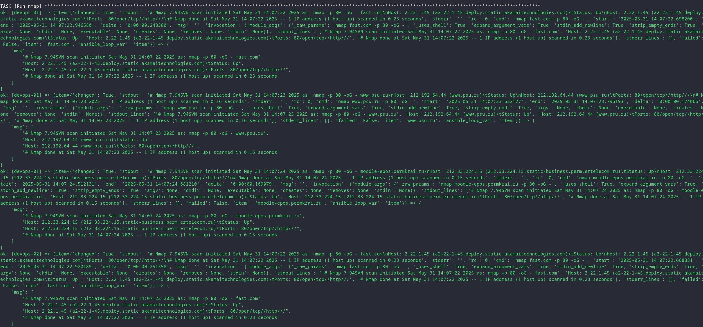
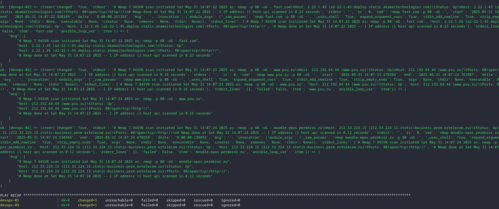

Сделать ansible-плейбук, который на целевых хостах:

- устанавливает сканер NMAP

- разбирает файл с целями на список и отдаёт цели на сканер в цикле

- запускает NMAP и сканирует цели с ключом -p 80 (в цикле)

- Собирает результаты сканирования (stdout)

- выводит результаты сканирования на экран


Создание инвентарного файла
```bash
sudo touch /etc/ansble/devops101_lab05/hosts
```
Инвентарный файл
```yaml
---
all:
  children:
    scanners:
      hosts:
        devops-01:
        devops-02:
...
```

Заготовка списка целей сканирования
```bash
sudo touch /etc/ansble/devops101_lab05/targets.txt
```

```txt
fast.com
www.psu.ru
moodle-epos.permkrai.ru
```

Создание playbook Scan Targets
```bash
sudo touch /etc/ansble/devops101_lab05/scan_targets.yml
```

playbook Scan Targets

```yaml
---
- name: Scan Targets
  become: true
  hosts: scanners

  tasks:
    - name: Install Nmap
      ansible.builtin.apt:
        name: nmap
        state: present
        update_cache: true

    - name: Run nmap
      ansible.builtin.shell: "nmap {{ item }} -p 80 -oG -"
      loop: "{{ lookup('file', './targets.txt').splitlines() }}"
      register: scan_results

    - name: Run nmap
      ansible.builtin.debug:
        msg: "{{ item.stdout_lines }}"
      loop: "{{ scan_results.results }}"

...
```

Проверка линтером на ошибки
```bash
yamllint hosts scan_targets.yml
```
Запуск playbook
```bash
ansible-playbook scan_targets.yml -i hosts
```

Вывод playbook
```bash
PLAY [Scan Targets] *******************************************************************************************************************************************************************************

TASK [Gathering Facts] ****************************************************************************************************************************************************************************
ok: [devops-02]
ok: [devops-01]

TASK [Install Nmap] *******************************************************************************************************************************************************************************
ok: [devops-02]
ok: [devops-01]

TASK [Run nmap] ***********************************************************************************************************************************************************************************
changed: [devops-02] => (item=fast.com)
changed: [devops-01] => (item=fast.com)
changed: [devops-02] => (item=www.psu.ru)
changed: [devops-01] => (item=www.psu.ru)
changed: [devops-01] => (item=moodle-epos.permkrai.ru)
changed: [devops-02] => (item=moodle-epos.permkrai.ru)

TASK [Run nmap] ***********************************************************************************************************************************************************************************
ok: [devops-01] => (item={'changed': True, 'stdout': '# Nmap 7.94SVN scan initiated Sat May 31 14:07:22 2025 as: nmap -p 80 -oG - fast.com\nHost: 2.22.1.45 (a2-22-1-45.deploy.static.akamaitechnologies.com)\tStatus: Up\nHost: 2.22.1.45 (a2-22-1-45.deploy.static.akamaitechnologies.com)\tPorts: 80/open/tcp//http///\n# Nmap done at Sat May 31 14:07:22 2025 -- 1 IP address (1 host up) scanned in 0.23 seconds', 'stderr': '', 'rc': 0, 'cmd': 'nmap fast.com -p 80 -oG -', 'start': '2025-05-31 14:07:22.698200', 'end': '2025-05-31 14:07:22.946580', 'delta': '0:00:00.248380', 'msg': '', 'invocation': {'module_args': {'_raw_params': 'nmap fast.com -p 80 -oG -', '_uses_shell': True, 'expand_argument_vars': True, 'stdin_add_newline': True, 'strip_empty_ends': True, 'argv': None, 'chdir': None, 'executable': None, 'creates': None, 'removes': None, 'stdin': None}}, 'stdout_lines': ['# Nmap 7.94SVN scan initiated Sat May 31 14:07:22 2025 as: nmap -p 80 -oG - fast.com', 'Host: 2.22.1.45 (a2-22-1-45.deploy.static.akamaitechnologies.com)\tStatus: Up', 'Host: 2.22.1.45 (a2-22-1-45.deploy.static.akamaitechnologies.com)\tPorts: 80/open/tcp//http///', '# Nmap done at Sat May 31 14:07:22 2025 -- 1 IP address (1 host up) scanned in 0.23 seconds'], 'stderr_lines': [], 'failed': False, 'item': 'fast.com', 'ansible_loop_var': 'item'}) => {
    "msg": [
        "# Nmap 7.94SVN scan initiated Sat May 31 14:07:22 2025 as: nmap -p 80 -oG - fast.com",
        "Host: 2.22.1.45 (a2-22-1-45.deploy.static.akamaitechnologies.com)\tStatus: Up",
        "Host: 2.22.1.45 (a2-22-1-45.deploy.static.akamaitechnologies.com)\tPorts: 80/open/tcp//http///",
        "# Nmap done at Sat May 31 14:07:22 2025 -- 1 IP address (1 host up) scanned in 0.23 seconds"
    ]
}
ok: [devops-01] => (item={'changed': True, 'stdout': '# Nmap 7.94SVN scan initiated Sat May 31 14:07:23 2025 as: nmap -p 80 -oG - www.psu.ru\nHost: 212.192.64.44 (www.psu.ru)\tStatus: Up\nHost: 212.192.64.44 (www.psu.ru)\tPorts: 80/open/tcp//http///\n# Nmap done at Sat May 31 14:07:23 2025 -- 1 IP address (1 host up) scanned in 0.16 seconds', 'stderr': '', 'rc': 0, 'cmd': 'nmap www.psu.ru -p 80 -oG -', 'start': '2025-05-31 14:07:23.622127', 'end': '2025-05-31 14:07:23.796193', 'delta': '0:00:00.174066', 'msg': '', 'invocation': {'module_args': {'_raw_params': 'nmap www.psu.ru -p 80 -oG -', '_uses_shell': True, 'expand_argument_vars': True, 'stdin_add_newline': True, 'strip_empty_ends': True, 'argv': None, 'chdir': None, 'executable': None, 'creates': None, 'removes': None, 'stdin': None}}, 'stdout_lines': ['# Nmap 7.94SVN scan initiated Sat May 31 14:07:23 2025 as: nmap -p 80 -oG - www.psu.ru', 'Host: 212.192.64.44 (www.psu.ru)\tStatus: Up', 'Host: 212.192.64.44 (www.psu.ru)\tPorts: 80/open/tcp//http///', '# Nmap done at Sat May 31 14:07:23 2025 -- 1 IP address (1 host up) scanned in 0.16 seconds'], 'stderr_lines': [], 'failed': False, 'item': 'www.psu.ru', 'ansible_loop_var': 'item'}) => {
    "msg": [
        "# Nmap 7.94SVN scan initiated Sat May 31 14:07:23 2025 as: nmap -p 80 -oG - www.psu.ru",
        "Host: 212.192.64.44 (www.psu.ru)\tStatus: Up",
        "Host: 212.192.64.44 (www.psu.ru)\tPorts: 80/open/tcp//http///",
        "# Nmap done at Sat May 31 14:07:23 2025 -- 1 IP address (1 host up) scanned in 0.16 seconds"
    ]
}
ok: [devops-01] => (item={'changed': True, 'stdout': '# Nmap 7.94SVN scan initiated Sat May 31 14:07:24 2025 as: nmap -p 80 -oG - moodle-epos.permkrai.ru\nHost: 212.33.224.15 (212.33.224.15.static-business.perm.ertelecom.ru)\tStatus: Up\nHost: 212.33.224.15 (212.33.224.15.static-business.perm.ertelecom.ru)\tPorts: 80/open/tcp//http///\n# Nmap done at Sat May 31 14:07:24 2025 -- 1 IP address (1 host up) scanned in 0.15 seconds', 'stderr': '', 'rc': 0, 'cmd': 'nmap moodle-epos.permkrai.ru -p 80 -oG -', 'start': '2025-05-31 14:07:24.512131', 'end': '2025-05-31 14:07:24.681210', 'delta': '0:00:00.169079', 'msg': '', 'invocation': {'module_args': {'_raw_params': 'nmap moodle-epos.permkrai.ru -p 80 -oG -', '_uses_shell': True, 'expand_argument_vars': True, 'stdin_add_newline': True, 'strip_empty_ends': True, 'argv': None, 'chdir': None, 'executable': None, 'creates': None, 'removes': None, 'stdin': None}}, 'stdout_lines': ['# Nmap 7.94SVN scan initiated Sat May 31 14:07:24 2025 as: nmap -p 80 -oG - moodle-epos.permkrai.ru', 'Host: 212.33.224.15 (212.33.224.15.static-business.perm.ertelecom.ru)\tStatus: Up', 'Host: 212.33.224.15 (212.33.224.15.static-business.perm.ertelecom.ru)\tPorts: 80/open/tcp//http///', '# Nmap done at Sat May 31 14:07:24 2025 -- 1 IP address (1 host up) scanned in 0.15 seconds'], 'stderr_lines': [], 'failed': False, 'item': 'moodle-epos.permkrai.ru', 'ansible_loop_var': 'item'}) => {
    "msg": [
        "# Nmap 7.94SVN scan initiated Sat May 31 14:07:24 2025 as: nmap -p 80 -oG - moodle-epos.permkrai.ru",
        "Host: 212.33.224.15 (212.33.224.15.static-business.perm.ertelecom.ru)\tStatus: Up",
        "Host: 212.33.224.15 (212.33.224.15.static-business.perm.ertelecom.ru)\tPorts: 80/open/tcp//http///",
        "# Nmap done at Sat May 31 14:07:24 2025 -- 1 IP address (1 host up) scanned in 0.15 seconds"
    ]
}
ok: [devops-02] => (item={'changed': True, 'stdout': '# Nmap 7.94SVN scan initiated Sat May 31 14:07:22 2025 as: nmap -p 80 -oG - fast.com\nHost: 2.22.1.45 (a2-22-1-45.deploy.static.akamaitechnologies.com)\tStatus: Up\nHost: 2.22.1.45 (a2-22-1-45.deploy.static.akamaitechnologies.com)\tPorts: 80/open/tcp//http///\n# Nmap done at Sat May 31 14:07:22 2025 -- 1 IP address (1 host up) scanned in 0.23 seconds', 'stderr': '', 'rc': 0, 'cmd': 'nmap fast.com -p 80 -oG -', 'start': '2025-05-31 14:07:22.668831', 'end': '2025-05-31 14:07:22.920189', 'delta': '0:00:00.251358', 'msg': '', 'invocation': {'module_args': {'_raw_params': 'nmap fast.com -p 80 -oG -', '_uses_shell': True, 'expand_argument_vars': True, 'stdin_add_newline': True, 'strip_empty_ends': True, 'argv': None, 'chdir': None, 'executable': None, 'creates': None, 'removes': None, 'stdin': None}}, 'stdout_lines': ['# Nmap 7.94SVN scan initiated Sat May 31 14:07:22 2025 as: nmap -p 80 -oG - fast.com', 'Host: 2.22.1.45 (a2-22-1-45.deploy.static.akamaitechnologies.com)\tStatus: Up', 'Host: 2.22.1.45 (a2-22-1-45.deploy.static.akamaitechnologies.com)\tPorts: 80/open/tcp//http///', '# Nmap done at Sat May 31 14:07:22 2025 -- 1 IP address (1 host up) scanned in 0.23 seconds'], 'stderr_lines': [], 'failed': False, 'item': 'fast.com', 'ansible_loop_var': 'item'}) => {
    "msg": [
        "# Nmap 7.94SVN scan initiated Sat May 31 14:07:22 2025 as: nmap -p 80 -oG - fast.com",
        "Host: 2.22.1.45 (a2-22-1-45.deploy.static.akamaitechnologies.com)\tStatus: Up",
        "Host: 2.22.1.45 (a2-22-1-45.deploy.static.akamaitechnologies.com)\tPorts: 80/open/tcp//http///",
        "# Nmap done at Sat May 31 14:07:22 2025 -- 1 IP address (1 host up) scanned in 0.23 seconds"
    ]
}
ok: [devops-02] => (item={'changed': True, 'stdout': '# Nmap 7.94SVN scan initiated Sat May 31 14:07:23 2025 as: nmap -p 80 -oG - www.psu.ru\nHost: 212.192.64.44 (www.psu.ru)\tStatus: Up\nHost: 212.192.64.44 (www.psu.ru)\tPorts: 80/open/tcp//http///\n# Nmap done at Sat May 31 14:07:23 2025 -- 1 IP address (1 host up) scanned in 0.16 seconds', 'stderr': '', 'rc': 0, 'cmd': 'nmap www.psu.ru -p 80 -oG -', 'start': '2025-05-31 14:07:23.579384', 'end': '2025-05-31 14:07:23.761887', 'delta': '0:00:00.182503', 'msg': '', 'invocation': {'module_args': {'_raw_params': 'nmap www.psu.ru -p 80 -oG -', '_uses_shell': True, 'expand_argument_vars': True, 'stdin_add_newline': True, 'strip_empty_ends': True, 'argv': None, 'chdir': None, 'executable': None, 'creates': None, 'removes': None, 'stdin': None}}, 'stdout_lines': ['# Nmap 7.94SVN scan initiated Sat May 31 14:07:23 2025 as: nmap -p 80 -oG - www.psu.ru', 'Host: 212.192.64.44 (www.psu.ru)\tStatus: Up', 'Host: 212.192.64.44 (www.psu.ru)\tPorts: 80/open/tcp//http///', '# Nmap done at Sat May 31 14:07:23 2025 -- 1 IP address (1 host up) scanned in 0.16 seconds'], 'stderr_lines': [], 'failed': False, 'item': 'www.psu.ru', 'ansible_loop_var': 'item'}) => {
    "msg": [
        "# Nmap 7.94SVN scan initiated Sat May 31 14:07:23 2025 as: nmap -p 80 -oG - www.psu.ru",
        "Host: 212.192.64.44 (www.psu.ru)\tStatus: Up",
        "Host: 212.192.64.44 (www.psu.ru)\tPorts: 80/open/tcp//http///",
        "# Nmap done at Sat May 31 14:07:23 2025 -- 1 IP address (1 host up) scanned in 0.16 seconds"
    ]
}
ok: [devops-02] => (item={'changed': True, 'stdout': '# Nmap 7.94SVN scan initiated Sat May 31 14:07:24 2025 as: nmap -p 80 -oG - moodle-epos.permkrai.ru\nHost: 212.33.224.15 (212.33.224.15.static-business.perm.ertelecom.ru)\tStatus: Up\nHost: 212.33.224.15 (212.33.224.15.static-business.perm.ertelecom.ru)\tPorts: 80/open/tcp//http///\n# Nmap done at Sat May 31 14:07:24 2025 -- 1 IP address (1 host up) scanned in 0.12 seconds', 'stderr': '', 'rc': 0, 'cmd': 'nmap moodle-epos.permkrai.ru -p 80 -oG -', 'start': '2025-05-31 14:07:24.530366', 'end': '2025-05-31 14:07:24.670259', 'delta': '0:00:00.139893', 'msg': '', 'invocation': {'module_args': {'_raw_params': 'nmap moodle-epos.permkrai.ru -p 80 -oG -', '_uses_shell': True, 'expand_argument_vars': True, 'stdin_add_newline': True, 'strip_empty_ends': True, 'argv': None, 'chdir': None, 'executable': None, 'creates': None, 'removes': None, 'stdin': None}}, 'stdout_lines': ['# Nmap 7.94SVN scan initiated Sat May 31 14:07:24 2025 as: nmap -p 80 -oG - moodle-epos.permkrai.ru', 'Host: 212.33.224.15 (212.33.224.15.static-business.perm.ertelecom.ru)\tStatus: Up', 'Host: 212.33.224.15 (212.33.224.15.static-business.perm.ertelecom.ru)\tPorts: 80/open/tcp//http///', '# Nmap done at Sat May 31 14:07:24 2025 -- 1 IP address (1 host up) scanned in 0.12 seconds'], 'stderr_lines': [], 'failed': False, 'item': 'moodle-epos.permkrai.ru', 'ansible_loop_var': 'item'}) => {
    "msg": [
        "# Nmap 7.94SVN scan initiated Sat May 31 14:07:24 2025 as: nmap -p 80 -oG - moodle-epos.permkrai.ru",
        "Host: 212.33.224.15 (212.33.224.15.static-business.perm.ertelecom.ru)\tStatus: Up",
        "Host: 212.33.224.15 (212.33.224.15.static-business.perm.ertelecom.ru)\tPorts: 80/open/tcp//http///",
        "# Nmap done at Sat May 31 14:07:24 2025 -- 1 IP address (1 host up) scanned in 0.12 seconds"
    ]
}

PLAY RECAP ****************************************************************************************************************************************************************************************
devops-01                  : ok=4    changed=1    unreachable=0    failed=0    skipped=0    rescued=0    ignored=0   
devops-02                  : ok=4    changed=1    unreachable=0    failed=0    skipped=0    rescued=0    ignored=0  
```




